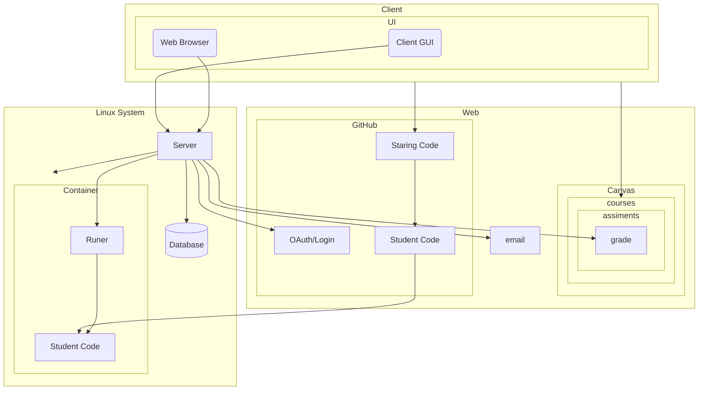

# Auto Grader

**Task**: auto run unit tests on students code and push the results.

**Need to do**:

- Allow teachers to setup assignments
  - get unit tests from the teacher
  - where is the student code
  - where to store the scores
  - Types of run events
- When event happens (student push there code, teacher click run) run the unit tests on the students code
  - Event:
    - On push (git)
    - On pull request (git)
    - Teacher click runs
    - **WANT**: Submission 
  - Run:
    - Some container
      - Docker
    - unit test system
      - Start with Junit and checkstyle
- Push/make the scores  
  - Read unit test results
    - **NOT** Just pass/fail (GitHub Classroom)
  - Canvas LMS API

## Notes

- Link student code to student score 
  - If the two things are not link then have student login to auto grade to link them.
  - When teacher does this it can be easy to link the student to the wrong account
- When using public systems
  - Check if other students can see it
    - Ex on every push on git check if private and check for collaborators
  -  Git fork?

## TODO

Before starting

- [ ] Login system
- [ ] OAuth (log in to GitHub and canvas)
- [ ] Logging
- [ ] Container System
  - [ ] Docker?

## Drawing

## Links

Canvas API: https://canvas.instructure.com/doc/api/submissions.html

Canvas Rust: https://crates.io/crates/canvasapi

GitHub API: https://docs.github.com/en/rest

GitHub OAuth: https://docs.github.com/en/apps/oauth-apps/building-oauth-apps/authorizing-oauth-apps

Rust GUI: https://crates.io/crates/egui

Actix Web: https://actix.rs/

Diesel (database): https://diesel.rs/

